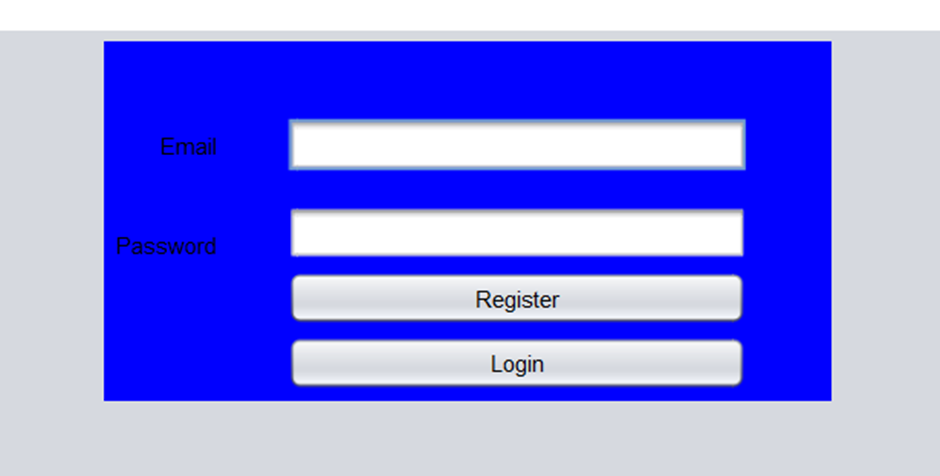
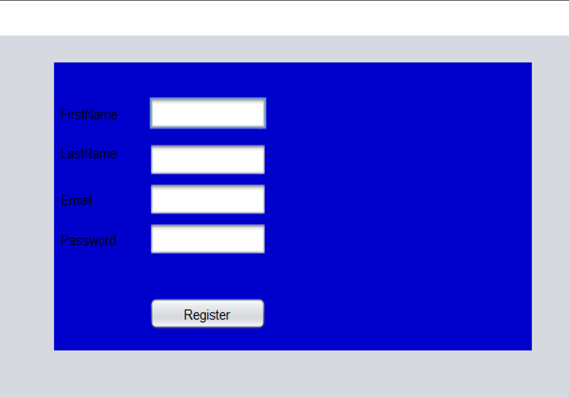
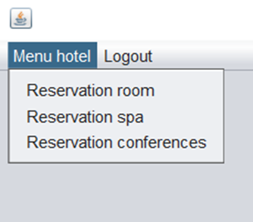
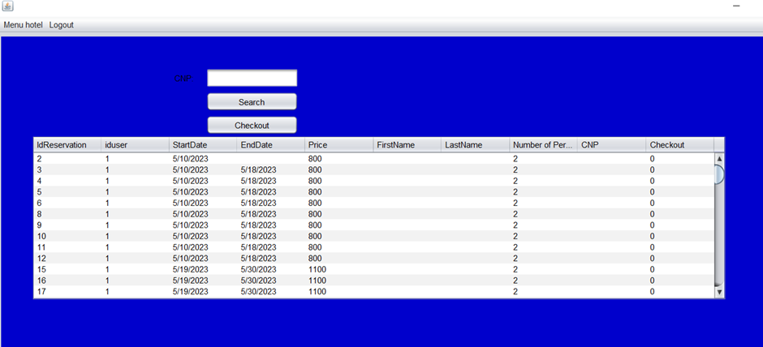
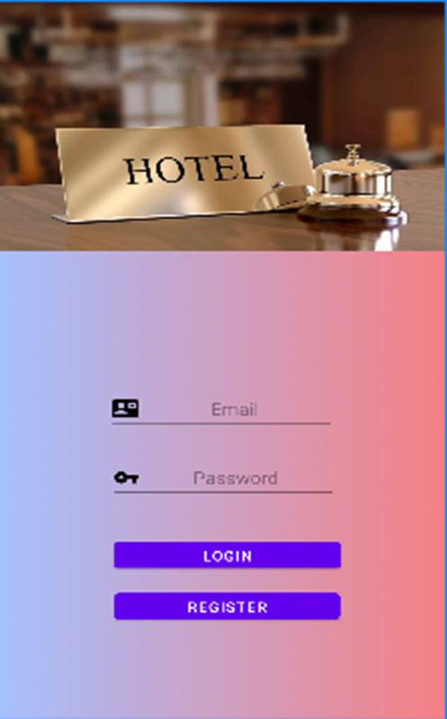
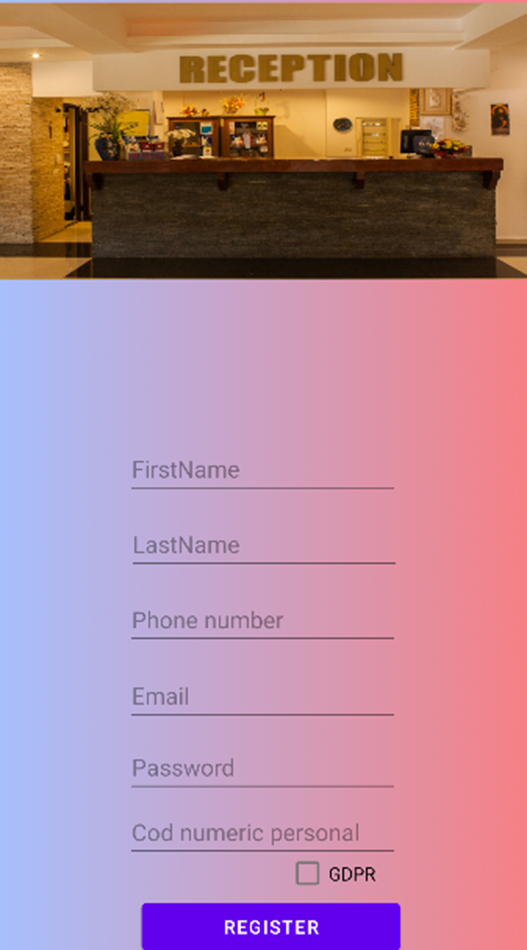
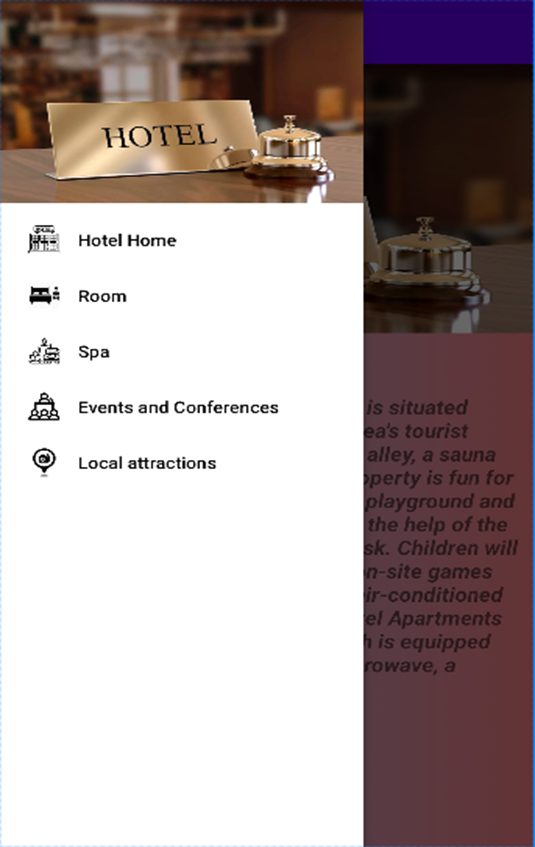
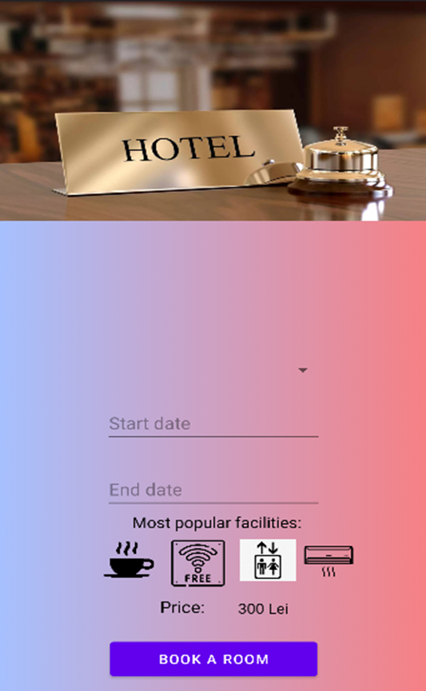
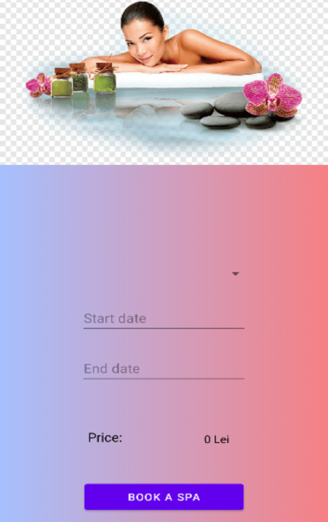
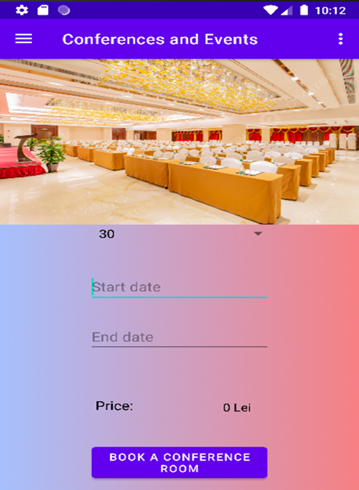

# 🏨 Hotel Booking Application

This project is a hotel reservation management system developed as a bachelor's thesis.
It includes both a **Desktop application (Java Swing)** and an **Android application**.

---

## 🚀 Features

* User authentication (Register / Login)
* Room booking system
* Spa reservation
* Conference room reservation
* Reservation management (search & checkout)
* MySQL database integration

---

## 💻 Desktop Application

The desktop application is built using **Java Swing** and provides full reservation management.

### Screenshots

#### 🔐 Login



#### 📝 Register



#### 📋 Menu



#### 📊 Reservations Panel



---

## 📱 Android Application

The Android app allows users to book hotel services directly from mobile devices.

### Screenshots

#### 🔐 Login



#### 📝 Register



#### 📋 Menu



#### 🏨 Room Booking



#### 💆 Spa Booking



#### 🎤 Conferences & Events



---

## 🛠️ Technologies Used

* Java (Swing - Desktop)
* Android (Java)
* MySQL Database
* JDBC

---

## ⚙️ Setup Instructions

1. Clone the repository:

```
git clone https://github.com/MihaiCovasan/hotel-booking-app.git
```

2. Open the project:

* Desktop: NetBeans / IntelliJ
* Mobile: Android Studio

3. Database setup:

* Import `hotel.sql` into MySQL
* Update database connection settings in the project

---

## 👨‍💻 Author

* Mihai Covasan

---

## ⚡ Notes

* Make sure images are placed correctly in:

  * `images/android/`
  * `images/desktop/`
* File names must match exactly with those used in this README

---

## ⭐ Project Status

✔️ Functional Desktop Application
✔️ Functional Android Application
✔️ Database integrated
✔️ Ready for presentation / portfolio
